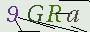
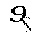
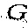
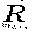
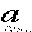
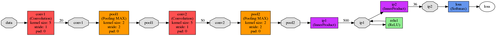

# SYSUvc
## 1、数据的采集（collectvc.py)
数据采集链接是鸭大的CAS验证中心中的验证码[url](https://cas.sysu.edu.cn/cas/captcha.jsp)
 为了提高识别率，我还进行了一些图像处理，整个流程如下：
###
1、分割图片，原图长90px，刚好字符类似均匀分布（90/4）
 2、把字符旁边的干扰线去掉，如果研究一下[jsp生成验证码](http://jadyer.cn/2015/07/16/sso-cas-login-captcha/)，就会发现背景、字符、干扰线一般在三个颜色区间，经实验发现干扰线极有可能类似这样：
####
    setColor(this.getRandColor(random, 0, 15))
    —— 启发就是把像素值<=15的点变成白色
3、图像灰度化和二值化，需要用到OpenCV（python中 import cv2）处理完之后如下图：

处理前:

处理后:

###
## 2、把数据分成训练级和测试集（create_train_test_txt.py）
## 3、把图片转换成LMDB（create_lmdb.sh）
## 4、根据需要修改train.prototxt&solver.prototxt（我们用的是[LeNet](https://blog.csdn.net/bea_tree/article/details/51601197)模型）
超参数  | 意义|
--------- | --------|
batch_size  | 一次迭代图片 |
base_lr  | 学习率 |
test_iter  | 测试需要的迭代数 |
test_interval  | 迭代多少次后测试一次（一般迭代完全部图片就测试） |
snapshot  | 保存caffemodel |
###

## 5、训练(train_command.sh)
## 6、测试（testMyNet.py），从鸭大的验证码那里拿一张图片，分割，检测并输出分类
## 7、更进一步（~~testSE.py，实现教务系统自动查成绩、课表，怕查水表没有上传~~）
